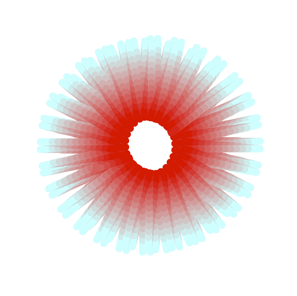
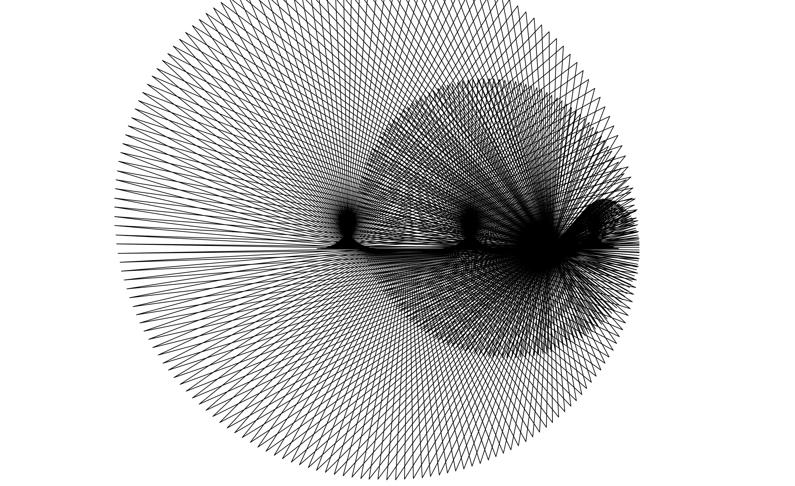
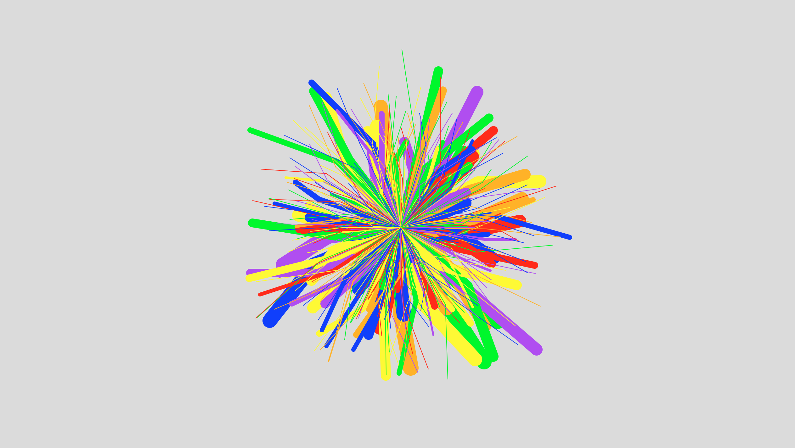
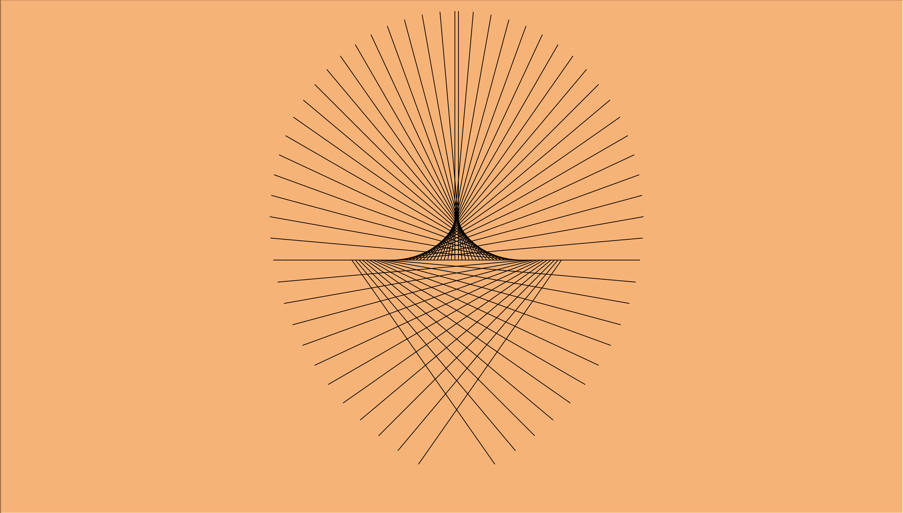
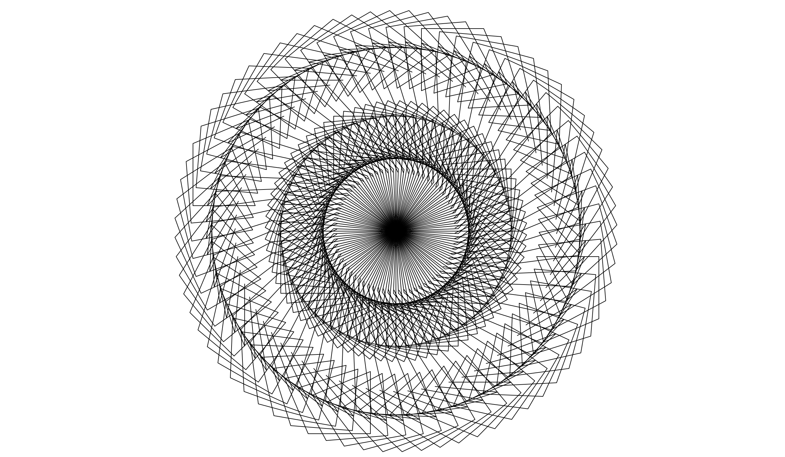

# python_turtle_art
A collection of digital art pieces made with python turtle

# red_star

 
 

# sliding_triangles

# spirograph_flower

# double_move_ray_art

# triangle_wallpaper

# stamps

# recursive_spirals

# rotating_triangles

# rays

# pattern_spirograph

# complex_web

